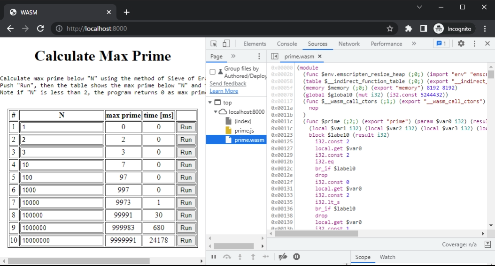

# Run WebAssembly

## Run on Browser

Now, let's run wasm on browser.  
First, confirm that these files are exist in the working directory.

-   **index.html** : sample html calling prime.wasm
-   **prime.wasm** : wasm built for browsers
-   **prime.js** : glue javascript program

Second, run a http server.  
Opening the index.html without running a server may not work because of the CORS policy of the browsers.

When using python, this command starts a http server.

```bash title="Run a http server at port 8000"
python -m http.server 8000
```

Third, access to the server from your browser.  
Then the page of sample index.html is shown and primes can be calculated by clicking `Run` buttons.


Many browsers support opening the wasm file in developer tools.  
This is an example of google chrome.



## Run Standalone

Now, let's run wasm standalone.  
Before to run, prepare wasm program built for standalone.

-   **prime-standalone.wasm** : wasm file built for standalone

or

-   **print_prime-standalone.wasm** : wasm file built for standalone (this is made for `wavm` runtime)

### wasmtime

[wasmtime](https://wasmtime.dev/) is standalone runtime for WebAssembly.
Executable file can be downloaded from [github releases](https://github.com/bytecodealliance/wasmtime/releases).

Command line options can be found at [CLI Options for wasmtime](https://docs.wasmtime.dev/cli-options.html).  
This command invokes the `prime()` function.

```bash title="invoke prime function with wasmtime"
wasmtime run prime_standalone.wasm --invoke prime 10000
```

```bash title="output"
warning: using `--invoke` with a function that takes arguments is experimental and may break in the future
warning: using `--invoke` with a function that returns values is experimental and may break in the future
9973
```

### wasmer

[wasmer](https://wasmer.io/) is also a famous standalone runtime for WebAssembly.
Executable files can be downloaded at [github releases](https://github.com/wasmerio/wasmer/releases).

Command line options can be found at [CLI Usage](https://docs.wasmer.io/ecosystem/wasmer/usage).  
This command invokes the `prime()` function.

```bash title="invoke prime function with wasmer"
wasmer run --invoke prime prime_standalone.wasm -- 10000
```

```bash title="output"
9973
```

### wasm3

[wasm3](https://github.com/wasm3/wasm3) is an interpreter for WebAssembly.
Executable files can be downloaded at [github releases](https://github.com/wasm3/wasm3/releases).

wasm3 options can be found by the command `wasm3 --help`.  
This command invokes the prime() function.

```bash title="invoke prime function with wasm3"
wasm3 --func prime prime_standalone.wasm 10000
```

```bash title="output"
Result: 9973
```

### Deno

[Deno](https://github.com/denoland/deno) is also a runtime for WebAssembly which uses [V8](https://v8.dev/).  
Executable files can be downloaded at [github releases](https://github.com/denoland/deno/releases).

First, we need to write a typescript to call functions.

```typescript title="Deno.ts"
const wasmCode = await Deno.readFile("./prime_standalone.wasm");
const wasmModule = new WebAssembly.Module(wasmCode);
const wasmInstance = new WebAssembly.Instance(wasmModule);
const prime = wasmInstance.exports.prime as CallableFunction;

let n = +Deno.args[Deno.args.length - 1];

let startTime = performance.now();
let maxPrime = prime(n);
let endTime = performance.now();

console.log("given number =", n);
console.log("max prime =", maxPrime);
console.log("duration [ms] =", (endTime - startTime).toFixed(2));
```

Then, run the command as follows.  
More command line options can be found at [Command line interface](https://deno.land/manual@v1.8.3/getting_started/command_line_interface).

```bash title="invoke prime function with Deno"
deno run --allow-read deno.ts -- 10000
```

```bash title="output"
given number = 10000
max prime = 9973
duration [ms] = 2.00
```

### wasmi

[wasmi](https://github.com/paritytech/wasmi) is an interpreter of WebAssembly written in Rust.  
We have to build `wasmi_cli` from source code because executable file is not distributed.

This is the command to invoke `prime()` function with wasme_cli.

```bash title="invoke prime function with wasmi"
wasmi_cli prime_standalone.wasm prime 10000
```

```bash title="output"
executing prime.wasm::prime(10000) ...
9973
```

More options can be seen with `wasmi_cli --help` or `wasmi_cli run --help`.

### WAVM

[WAVM (WebAssembly Virtual Machine)](https://github.com/WAVM/WAVM) is also a well known runtime for WebAssembly.  
Executable files can be downloaded at [github releases](https://github.com/WAVM/WAVM/releases).

Unlike other runtime, WAVM does not print the returned value.  
So, print function should be in the source code to see the calculated result.  
Some sample program (not all) contain function named `print_prime` for the purpose of this situation.

So, lets use `print_prime.wasm` here.

This command invoke `print_prime` function and show the calculate result.

```bash title="invoke print_prime function with WAVM"
wavm run --function=print_prime print_prime_standalone.wasm 10000
```

```bash title="output"
max prime = 9973
```

More options can be seen with `wavm --help` or `wavm run --help`.
