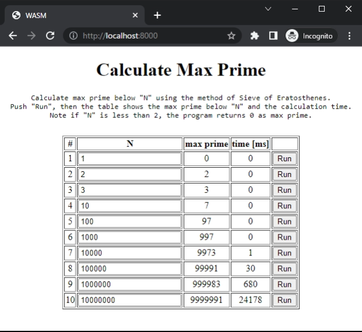
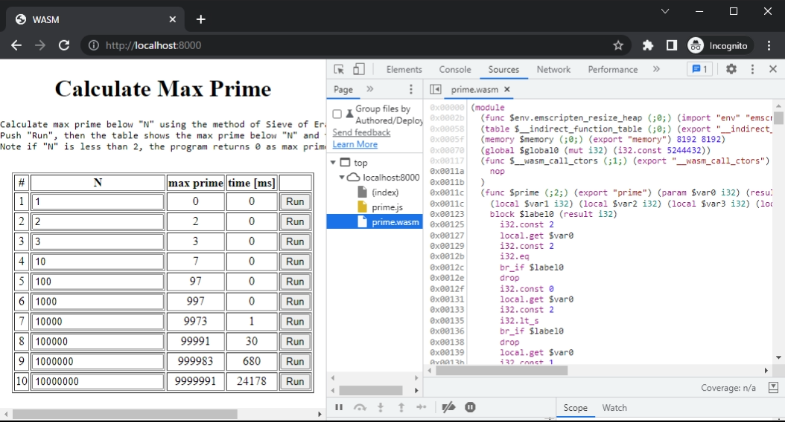

# Run on Browsers

Now, let's run wasm on browser.  
First, confirm that these files are exist in the working directory.

-   **index.html** : sample html calling prime.wasm
-   **prime.wasm** : wasm built for browsers
-   **prime.js** : glue javascript program

Second, run a http server.  
Opening the index.html without running a server may not work because of the CORS policy of the browsers.

When using python, this command starts a http server.

```bash title="Run a http server at port 8000"
python -m http.server 8000
```

Third, access to the server from your browser.  
Then the page of sample index.html is shown and primes can be calculated by clicking `Run` buttons.



Many browsers support opening the wasm file in developer tools.  
This is an example of google chrome.


